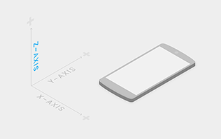

#环境(Environment)   

##三维世界(3D world)   

Material环境是一个三维的空间,这意味着每个对象都有x,y,z三种尺寸属性,
z轴垂直对齐于显示平面,并随着z轴延伸向用户视角,每个material元素在z轴
上占据一定的位置并且有一个1dp厚度的标准       

   

##光影关系(Light and shadow)    

在material环境中,虚拟的光线照射场景并且使其中的对象投射出阴影,基本的
光线投射出一个定向的阴影,而环境光从各个角度投射出连贯又柔和的阴影.    

material环境中的所有阴影都是由这两种光投射产生的,阴影是光线照射不到的
地方,因为各个元素在z轴上占据了不同大小的位置遮挡住了这些光线.

       
   
基本光产生的阴影   
   
环境光产生的阴影   
   
环境光和基本光共同的阴影